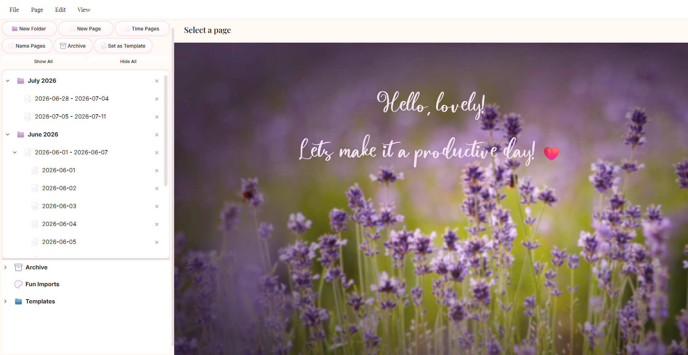
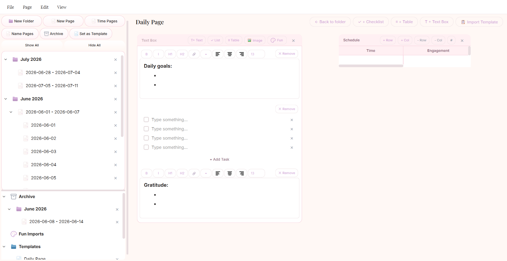

<p align="center">
  
</p>

<h1 align="center">Personal Productivity App</h1>

<p align="center">
  A desktop productivity app with a freeform canvas editor, built with PyQt6 and SQLite.<br>
  Organize pages, tasks, tables, and notes — all on a drag-and-drop canvas.
</p>

<p align="center">
  
</p>

---

## Features

### Page & Folder Management
- Hierarchical page tree with folders and nested pages
- Bulk create pages by date range (days, weeks, years) or numbered sequences
- Archive pages to a dedicated Archive folder
- Move pages between folders via dialog
- Multi-select with Shift/Ctrl for bulk operations
- Context menu: rename, delete, archive, move, reorder

### Block-Based Canvas Editor
- Freeform canvas — position content blocks anywhere by dragging
- Four block types: **Text**, **Table**, **Task List**, **Checkbox**
- Resizable blocks with drag handles
- Editable headers with configurable alignment

<p align="center">
  
</p>

### Rich Text Editing
- Markdown-based editing with live preview
- Formatting toolbar: Bold, Italic, H1, H2, Code, Link, Bullet List
- Font size selector (9–32pt)
- Inline image pasting and file attachment
- Image drag-and-drop support

### Task & To-Do Lists
- Checkbox tasks with recurrence (none / daily / weekly / monthly)
- Recurring tasks auto-create a copy with advanced due date when checked off
- Embedded task lists inside text blocks and table cells

### Table Blocks
- Dynamic add/remove rows and columns
- Toggleable header row and row numbers
- Rich text editing in cells
- Task lists embedded in cells
- Tab/Shift+Tab navigation between cells

### Templates
- Save any page as a named template
- Insert templates into single or multiple pages at once
- Editing a template page syncs changes back to the template database

### Emoji & GIF Support
- Categorized emoji picker (Smileys, Gestures, Hearts, Animals, Food, etc.)
- GIF browser with categories (Trending, Reactions, Celebrations)
- Insert at cursor position in any text field

### Undo System
- Undo page, block, and task deletions with Ctrl+Z
- 15-minute TTL — actions expire after 15 minutes
- Recursive restore for full page trees (page + children + blocks + tasks)

### Auto-Save & Settings
- Configurable auto-save interval (500–10,000ms)
- Customizable font size, week start day, and theme
- Settings stored in `settings.json`

---

## Tech Stack

| Component | Detail |
|-----------|--------|
| Language | Python 3.10+ |
| GUI | [PyQt6](https://pypi.org/project/PyQt6/) >= 6.11 |
| Markdown | [markdown](https://pypi.org/project/markdown/) >= 3.10 |
| Database | SQLite3 (WAL mode, foreign keys) |
| Testing | pytest, pytest-qt, pytest-cov |
| Linting | [ruff](https://github.com/astral-sh/ruff) |
| Type checking | [mypy](https://mypy-lang.org/) |

---

## Getting Started

### Prerequisites

- Python 3.10 or later
- pip

### Installation

```bash
# Clone the repository
git clone https://github.com/tedypav/personal-productivity-app.git
cd personal-productivity-app

# Install dependencies
pip install -r requirements.txt

# Install development tools (optional)
pip install ruff mypy pre-commit pytest-cov pytest-qt

# Install pre-commit hooks (optional)
pre-commit install
```

### Running the App

```bash
python run.py
```

The app opens maximized. The database (`app.db`) and settings (`settings.json`) are created automatically on first run.

---

## Project Structure

```
personal-productivity-app/
├── run.py                  # Entry point
├── pyproject.toml          # Project config and tool settings
├── requirements.txt        # Runtime dependencies
├── assets/
│   ├── background/         # Welcome screen background
│   ├── fonts/              # Inter, Playfair Display, Magnolia
│   ├── icons/              # App icons (SVG, ICO)
│   ├── mockups/            # Design mockups
│   ├── screenshots/        # App screenshots for README
│   └── ui/                 # Design tokens (colors, spacing)
├── src/
│   ├── main.py             # App bootstrap, stylesheet, fonts
│   ├── database.py         # SQLite connection, schema, migrations
│   ├── settings.py         # JSON settings load/save
│   ├── undo_manager.py     # Undo system with 15-min TTL
│   ├── models/             # Dataclasses: Page, ContentBlock, Task, Template
│   ├── repositories/       # CRUD repositories for each model
│   └── ui/
│       ├── main_window.py  # Main window, menu bar, shortcuts
│       ├── sidebar.py      # Page tree, templates, Fun Imports
│       └── editor.py       # Canvas, blocks, editor components
└── tests/                  # 20+ test files with 90%+ coverage target
```

---

## Keyboard Shortcuts

| Shortcut | Action |
|----------|--------|
| `Ctrl+N` | New page |
| `Ctrl+Shift+N` | New child page |
| `Ctrl+S` | Save |
| `Ctrl+Q` | Exit |
| `Ctrl+B` | Bold |
| `Ctrl+I` | Italic |
| `Ctrl+Z` | Undo delete |
| `Ctrl+Shift+Z` | Redo undo |
| `Ctrl+D` | Delete selected blocks |
| `Ctrl+Shift+B` | Bulk create pages |
| `Delete` | Delete selected page/block |
| `F2` | Rename selected page |

---

## Testing

```bash
# Run all tests
python -m pytest

# Run with verbose output
python -m pytest -v

# Run a specific test file
python -m pytest tests/test_models.py -v

# Run with coverage report
python -m pytest --cov=src --cov-report=term-missing
```

Coverage target: 90% (enforced via `pyproject.toml`).

---

## Development

### Code Quality

```bash
# Lint
ruff check src/

# Format
ruff format src/

# Type check
mypy src/
```

### Pre-commit Hooks

The project uses pre-commit to enforce code quality on every commit:

- **ruff** — linting and auto-fix
- **ruff-format** — code formatting
- **mypy** — type checking

```bash
# Install hooks
pre-commit install

# Run manually on all files
pre-commit run --all-files
```

---

## Acknowledgements

- **Inter** — UI body font
- **Playfair Display** — heading font
- **Magnolia** — decorative greeting font
- Design system based on warm pastel palette with soft shadows and rounded corners
